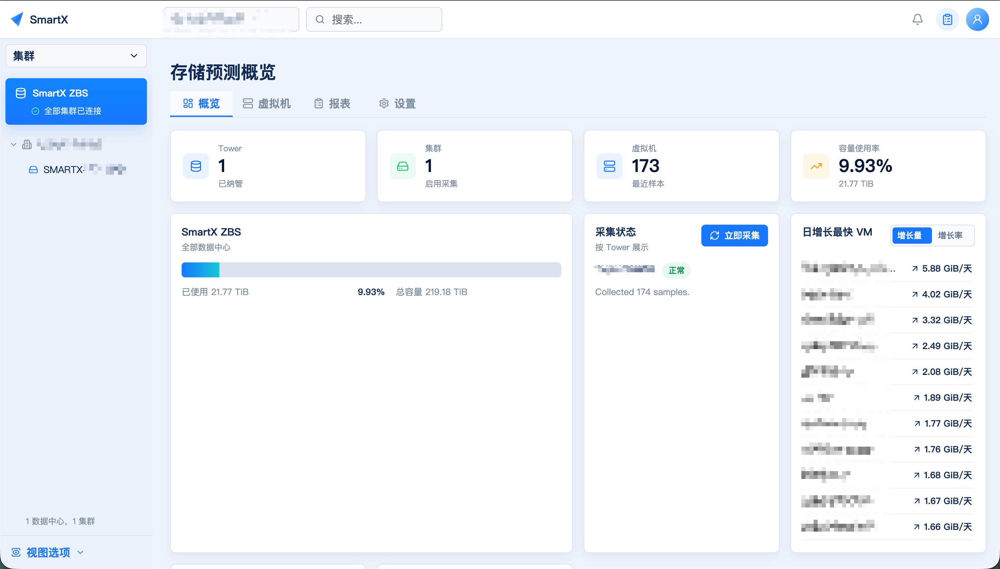
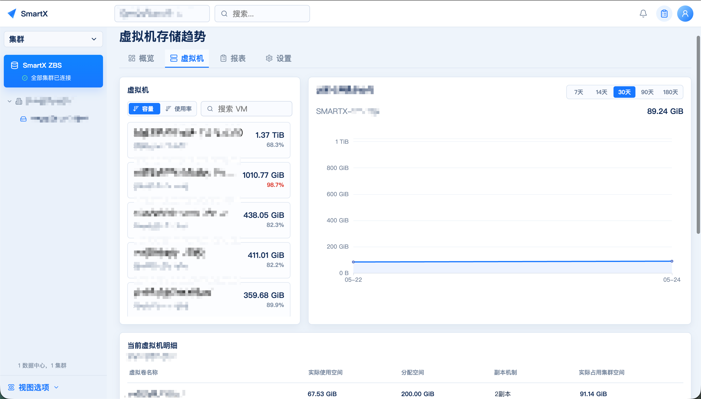
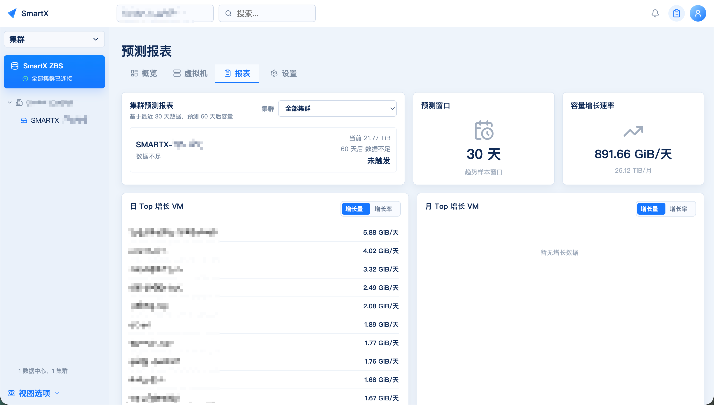
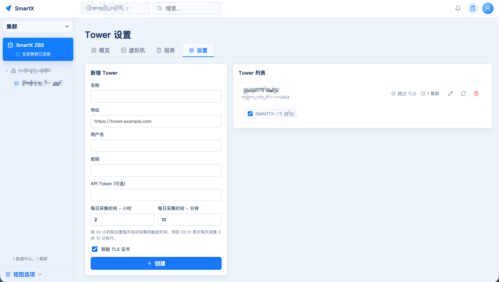

# SmartX HCI Capacity Insight

简体中文 | [English](README.md)

**SmartX 超融合容量洞察平台**

版本：`v0.4.0`

> 状态：本项目目前处于测试阶段，未经充分验证前不建议直接用于生产环境。

SmartX 超融合容量洞察平台面向 SmartX 超融合环境，用于采集 CloudTower/Tower 下的数据中心、集群、虚拟机与虚拟卷容量数据，提供容量概览、虚拟机存储趋势、Top 增长 VM、集群预测报表和容量风险提示，帮助运维人员持续跟踪资源使用变化并提前识别容量压力。

> 说明：本项目由 AI 辅助编写。

## 功能特性

- 支持多 Tower、多集群容量概览。
- 支持每日自动采集和手动触发采集。
- 虚拟机存储趋势支持 7 天、14 天、30 天、90 天、180 天和 365 天查看。
- 虚拟机列表支持按存储容量和虚拟机内部存储使用率排序。
- 支持当前虚拟机卷明细和所有虚拟卷明细。
- 支持日 Top 增长 VM、月 Top 增长 VM，并可按增长量或增长率排序。
- Top 增长 VM 支持点击跳转到虚拟机页面并选中对应虚拟机。
- 支持基于历史样本的集群容量预测报表，并联动展示集群容量趋势图。
- 支持按全部、Tower 或单集群范围导出预测报表，自动生成 Word 和 Excel 文件。
- 导出报表支持选择 7 天、14 天、30 天、90 天、180 天和 365 天历史窗口。
- 支持 Tower 级采集状态展示，平台密码可在管理员头像菜单中修改。

## 界面预览

### 概览页



### 虚拟机存储趋势



### 预测报表



### Tower 设置



## 架构

```text
CloudTower/Tower
      |
      v
collector-worker ----> SQLite (/data/smartx.db)
      |                    |
      v                    v
Prometheus <---------- web-api (FastAPI)
                           |
                           v
frontend (React + TypeScript + ECharts)
```

## 仓库结构

```text
backend/       FastAPI API、采集器、CloudTower 客户端、预测逻辑和 CLI
frontend/      React + TypeScript 前端
prometheus/    Prometheus 抓取配置
docs/          API、部署、使用说明和截图资源
docker-compose.yml
.env.example
```

## 快速开始

目标服务器需要具备：

- Docker
- Docker Compose

创建环境变量文件：

```bash
cp .env.example .env
```

生产环境请修改 `.env` 中的密钥和默认密码：

```text
SMARTX_SECRET_KEY=replace-with-a-long-random-secret
SMARTX_CREDENTIAL_KEY=replace-with-a-different-long-random-secret
SMARTX_ADMIN_PASSWORD=password
```

启动服务：

```bash
docker compose up -d --build
```

默认访问地址：

```text
前端页面：   http://<server-ip>:8080
后端 API：  http://<server-ip>:8000
Prometheus: http://<server-ip>:9090
```

默认平台账号：

```text
用户名：admin
密码：password
```

首次登录后建议点击右上角管理员头像，在 `设置密码` 中修改密码。

## 离线升级包结构

平台支持在服务管理页面上传离线 `.tar.gz` 升级包。升级包用于替换服务镜像，也可以按需执行迁移脚本。升级包不应包含运行数据、`.env`、SQLite 数据库、Prometheus 数据、Tower 账号密码或其他敏感信息。

推荐目录结构：

```text
smartx-capacity-insight-v0.4.0-upgrade.tar.gz
├── manifest.json
├── release-notes.md                 # 可选
├── images/
│   ├── web-api.tar
│   ├── frontend.tar
│   ├── collector-worker.tar
│   └── upgrade-runner.tar           # 可选，用于组件升级包
└── scripts/
    └── migrate.sh                   # 可选，仅 database_migration=true 时需要
```

`manifest.json` 用于描述目标版本、最低兼容版本、镜像列表、镜像 SHA256 校验、是否需要数据库迁移、需要重启的服务和升级包类型。

字段示例：

```json
{
  "version": "v0.4.0",
  "min_compatible_version": "v0.3.0",
  "package_type": "platform",
  "database_migration": false,
  "restart_services": ["web-api", "collector-worker", "frontend"],
  "images": [
    {
      "service": "web-api",
      "file": "images/web-api.tar",
      "tag": "nazawsze/smartx-hci-capacity-insight-web-api:v0.4.0",
      "sha256": "<sha256>"
    }
  ]
}
```

普通平台升级包不建议在同一次升级任务中重启 `upgrade-runner`，避免中断正在执行升级的服务。如需替换 `upgrade-runner`，请使用组件升级包。

## 文档

- [部署说明](docs/deployment.md)
- [使用说明](docs/usage.md)
- [API 参考](docs/api.md)
- [upgrade-runner 生命周期与组件升级策略](docs/upgrade-runner-lifecycle.md)
- [v0.2 更新说明](docs/releases/v0.2.md)

## CloudTower 权限

建议使用只读 CloudTower 账号或只读 API Token。采集器只需要读取集群、虚拟机、虚拟卷和容量数据。

相关 CloudTower API：

- `/v2/api/login`
- `/v2/api/get-clusters`
- `/v2/api/get-cluster-storage-info`
- `/v2/api/get-vms`
- `/v2/api/get-vm-volumes`

## 重置密码

如果忘记平台登录密码，可以在目标服务器进入项目目录：

```bash
cd /opt/smartx-storage-forecast
```

交互式重置：

```bash
docker compose exec web-api python -m app.cli reset-password --username admin
```

也可以直接传入新密码：

```bash
docker compose exec web-api python -m app.cli reset-password --username admin --password password
```

重置完成后，使用新密码重新登录。

## 数据与安全说明

不要提交运行数据或敏感信息。仓库已明确排除：

- `.env`
- SQLite 数据库
- Prometheus 数据
- 已采集的 Tower、集群、虚拟机和虚拟卷数据
- SSH 密钥、证书和临时排查脚本

## 测试

开发或 CI 环境安装依赖后可以执行：

```bash
cd backend
pytest
```

```bash
cd frontend
npm test
```

## 许可证

MIT License。
